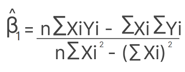
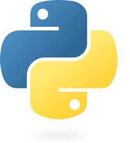

#### Eu sou Bruno Zolotareff dos Santos aluno do Descomplica! 

# Regrassão Linear  - Pós-graduação Descomplica - Pitch

### Curso de pós-graduação em Data Science 2025 - Avaliação 3 - Aplicação na prática
Avaliação na prática com dados reais para fazer uma pequena análise utilizando o <b>Cálculo da Reta e o R2</b>.  

- Escolha do assunto do módulo 3 como pré-requisito e <b>regras estabelecidas para essa avaliação de acordo com a equipe pedagógica: Regressão e Predição.</b>

# Objetivo

Este projeto tem como objetivo realizar uma análise de aprendizagem de máquina sobre uma amostra do crescimento da população do Brasil, utilizando dados do período de 1960 até 2018. O objetivo principal é entender a evolução da população ao longo dos anos e aplicar técnicas de aprendizagem de máquina para prever futuros comportamentos dessa variável. 

A atividade foi desenvolvida utilizando Python para processamento de dados e aplicação de modelos de aprendizagem de máquina. O ambiente utilizado para a execução do código foi o Google Colab, permitindo fácil acesso a bibliotecas e integração com recursos na nuvem. Para tornar o processo mais interativo e dinâmico, foi utilizado também JavaScript no Codespace para complementar a análise e visualização de dados.

### O fluxo do projeto inclui:

Coleta e pré-processamento dos dados: importação e limpeza da amostra da população brasileira entre 1960 e 2018.
Análise exploratória dos dados: visualização e interpretação do crescimento populacional ao longo das décadas.
Modelagem de aprendizagem de máquina: uso de modelos como regressão linear, árvores de decisão ou redes neurais para prever o crescimento populacional futuro.
Avaliação e visualização dos resultados: análise dos erros dos modelos e visualização das previsões em gráficos interativos.
Este projeto oferece uma visão prática da utilização de aprendizagem de máquina para análise de séries temporais e pode ser expandido com o uso de outras variáveis econômicas ou sociais para gerar previsões mais completas sobre o crescimento populacional.

### Tecnologias utilizadas:

- Python    
- Google Colab   
- Javascript 

#### Bibliotecas: 
- Pandas, NumPy, Scikit-learn, Matplotlib, Seaborn, TensorFlow (ou outras dependendo do modelo utilizado)

